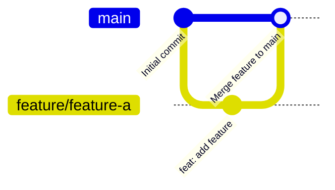
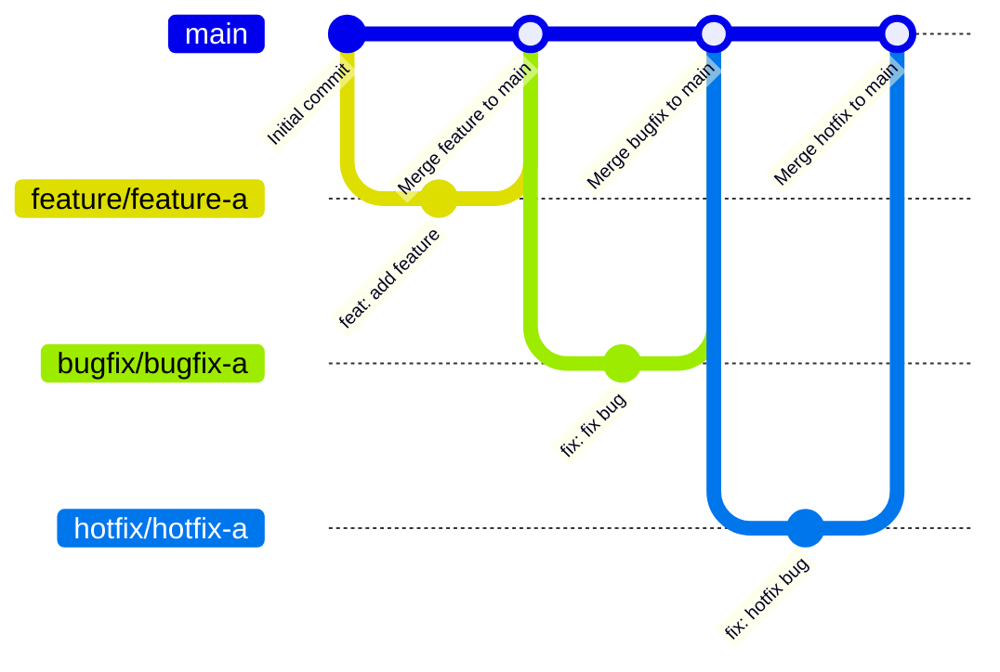
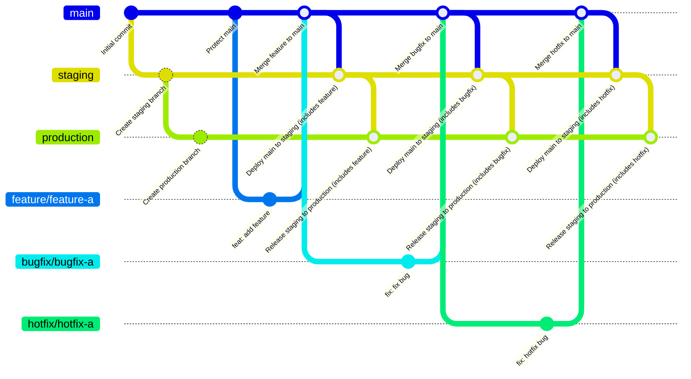
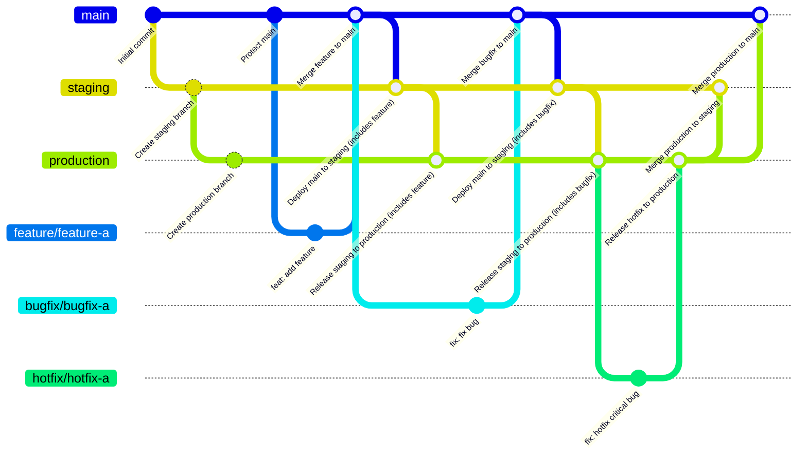

## はじめに

Mermaid（マーメイド）ってご存知ですか？

テキストベースでフローチャート、シーケンス図、ガントチャートなどの図やグラフを生成できるツールで、Markdown内にコードブロックとして埋め込むことができます。

今回はブランチ戦略の代表例として取り上げられることの多いGitHub flow/GitLab FlowをMermaidのGitGraphとして描いていこうと思います。

この記事では、各フローをMermaidで描画してみることを目的としており、各フローの詳細については取り上げませんのでご了承ください。

## GitHub flow

`main`と`feature`のみの最小構成です。バグ修正や緊急修正も`feature`で行います。



````

````

バグ修正や緊急修正を`bugfix`と`hotfix`という別ブランチに分けたパターンです。

単一環境の場合におすすめです。



````

````

## GitLab flow

すべてのブランチを`main`->`staging`->`production`と段階的にマージしていくパターンです。`staging`は`pre-production`という名前の場合もありますが、個人的には`staging`のほうがしっくりきます。

複数環境がある場合におすすめです。



````

````

先ほどとは異なり、`hotfix`のみ`main`ではなく`production`から分岐させ、`production`->`staging`->`main`とマージしていくパターンです。

緊急修正をすぐに本番環境に反映できるメリットがありますが、`staging`と`main`への反映を行わないと大変なことになりますし、緊急修正であってもステージングさせたほうが良いのでは？と個人的には思います。



````

````

## おわりに

いかがでしたか？Mermaidを推していきましょう。[公式ドキュメント](https://mermaid.js.org/syntax/gitgraph.html)もチェックしてみてください！